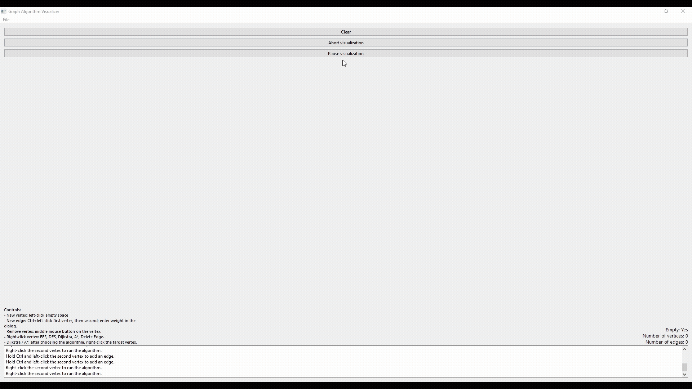

# Graph-Algorithm-Visualizer

Interactive tool for drawing **simple weighted graphs** and **step-by-step visualization** of **BFS**, **DFS**, **Dijkstra**, and **A\***. Desktop app in **C++** with **Qt Widgets**.

## Demo

*Click the preview above to open the full-resolution video.*

---

## Repository layout

```
Graph-Algorithm-Visualizer/
├── README.md
├── GraphAlgorithmVisualizer.pro
├── demo.gif
├── examples/                 # sample graphs
│   ├── random-graph.txt
│   ├── hub-and-ring.txt
│   ├── grid-12.txt
│   └── two-clusters.txt
├── main.cpp
├── Graph.cpp / Graph.h
├── GraphUserInterface.cpp / GraphUserInterface.h
└── tests/                    # Qt Test unit tests for Graph
    ├── tests.pro
    └── tst_graph.cpp
```

## Features

- Create vertices and edges (weights 1–20), drag vertices
- **Undirected**, **simple** graph (no loops or multiedges)
- Run algorithms from the vertex context menu; Dijkstra and A* use start and goal vertices
- Visualization with **pause** and **abort**; A* shows heuristic values (scaled from Euclidean distance and screen width)
- Load and save the graph as a text file
- Console for messages (validation errors, hints)

## Example graphs (`examples/`)

Text format: one line per vertex `x y`, then a line `EDGES`, then one line per edge `vertex_i vertex_j weight` (0-based indices, weights 1–20).


| File | Description |
|------|-------------|
| `hub-and-ring.txt` | Hub + 8-cycle on a ring (no extra chords on the same line as radials) — BFS layers, DFS on the ring, varied path lengths. |
| `grid-12.txt` | **3×4 grid** (12 vertices): full orthogonal grid plus crossing diagonals. |
| `two-clusters.txt` | Two dense 4-vertex clusters (each almost complete) linked by a **bridge**.|

Use **File → Load Graph** and pick a file from `examples/`.

## Requirements

- **Qt** 6.x (Widgets; Gui may be required depending on the kit)
- A compiler with **C++17** (MSVC, MinGW, Clang)
- **CMake** ≥ 3.16 or **qmake** (Qt Creator project)

## Building

### Qt Creator

1. **File → Open File or Project** and open `untitled/untitled.pro`, or create a *Qt Widgets Application* and replace sources with this repository’s files.
2. Ensure the project lists: `main.cpp`, `Graph.cpp`, `Graph.h`, `GraphUserInterface.cpp`, `GraphUserInterface.h`.
3. Pick a kit (compiler + Qt), then **Build** and **Run**.

## Tests

Unit tests for the `Graph` class use **Qt Test** and live in `tests/`.

| Test | What it guards |
|------|----------------|
| `addEdge_selfLoop_isRejectedWithMessage` | Self-loops are rejected and a `graphMessage` signal is emitted; no `graphChanged` is fired. |
| `addEdge_invalidIndex_isRejectedWithMessage` | Out-of-range and negative vertex indices are rejected with a message. |
| `addEdge_duplicateReversed_isRejectedWithMessage` | Adding `(b, a)` after `(a, b)` is rejected — the graph is undirected and simple, original weight stays untouched. |
| `removeVertex_shiftsIndicesInRemainingEdges` | **The most important regression test.** After removing a vertex, all incident edges are dropped and remaining edges have their endpoint indices `> vIndex` decremented (off-by-one trap). |
| `saveLoad_roundTripPreservesGraph` | Full serialization round-trip: `saveToFile` → `loadFromFile` reproduces vertex positions, edge endpoints and weights exactly. |
| `loadFromFile_skipsInvalidEdges` | Loader is resilient to a malformed file: self-loops, out-of-range indices, reversed duplicates and empty lines are silently skipped while valid edges still load. |
| `dijkstra_findsOptimalPathOverShortcut` | Dijkstra picks the cheap detour `0→1→2` (cost 2) instead of the direct edge `0→2` of weight 10. |
| `dijkstraVsAStar_agreeOnUniquePathInTree` | On a tree, where exactly one path exists between any two vertices, A* and Dijkstra return the same `shortestPath`. The tree shape removes any dependency on the heuristic scale (`heuristicScaleDivisor()` queries `QGuiApplication::primaryScreen()`). |